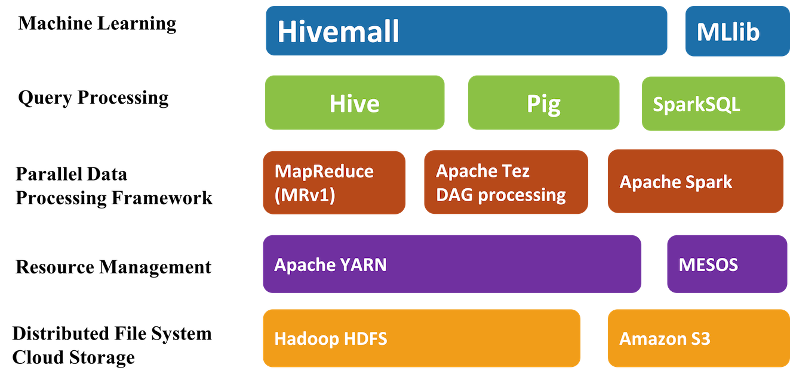

<!--
  Licensed to the Apache Software Foundation (ASF) under one
  or more contributor license agreements.  See the NOTICE file
  distributed with this work for additional information
  regarding copyright ownership.  The ASF licenses this file
  to you under the Apache License, Version 2.0 (the
  "License"); you may not use this file except in compliance
  with the License.  You may obtain a copy of the License at

    http://www.apache.org/licenses/LICENSE-2.0

  Unless required by applicable law or agreed to in writing,
  software distributed under the License is distributed on an
  "AS IS" BASIS, WITHOUT WARRANTIES OR CONDITIONS OF ANY
  KIND, either express or implied.  See the License for the
  specific language governing permissions and limitations
  under the License.
-->
        
# Introduction

Apache Hivemall is a collection of machine learning algorithms and versatile data analytics functions. It provides a number of ease of use machine learning functionalities through the <a href="https://cwiki.apache.org/confluence/display/Hive/LanguageManual+UDF">Apache Hive UDF/UDAF/UDTF interface</a>.

Apache Hivemall offers a variety of functionalities: <strong>regression, classification, recommendation, anomaly detection, k-nearest neighbor, and feature engineering</strong>. It also supports state-of-the-art machine learning algorithms such as Soft Confidence Weighted, Adaptive Regularization of Weight Vectors, Factorization Machines, and AdaDelta. 

## Architecture

Apache Hivemall is mainly designed to run on [Apache Hive](https://hive.apache.org/) but it also supports [Apache Pig](https://pig.apache.org/) and [Apache Spark](http://spark.apache.org/) for the runtime.
Thus, it can be considered as a cross platform library for machine learning; prediction models built by a batch query of Apache Hive can be used on Apache Spark/Pig, and conversely, prediction models build by Apache Spark can be used from Apache Hive/Pig.

---

Apache Hivemall is an effort undergoing incubation at The Apache Software Foundation (ASF), sponsored by the <a href="http://incubator.apache.org/">Apache Incubator</a>.
