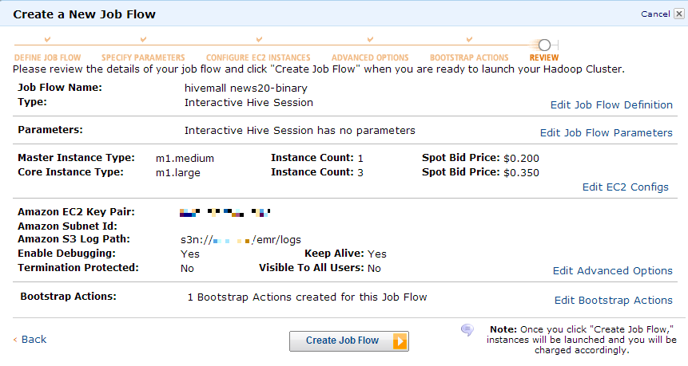
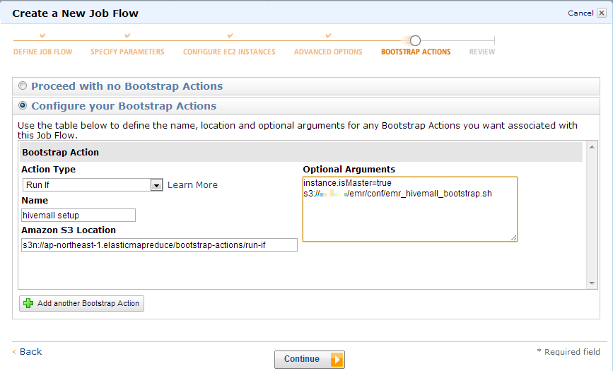

<!--
  Licensed to the Apache Software Foundation (ASF) under one
  or more contributor license agreements.  See the NOTICE file
  distributed with this work for additional information
  regarding copyright ownership.  The ASF licenses this file
  to you under the Apache License, Version 2.0 (the
  "License"); you may not use this file except in compliance
  with the License.  You may obtain a copy of the License at

    http://www.apache.org/licenses/LICENSE-2.0

  Unless required by applicable law or agreed to in writing,
  software distributed under the License is distributed on an
  "AS IS" BASIS, WITHOUT WARRANTIES OR CONDITIONS OF ANY
  KIND, either express or implied.  See the License for the
  specific language governing permissions and limitations
  under the License.
-->

<!-- toc -->
        
## Prerequisite
Learn how to use Hive with Elastic MapReduce (EMR).  
http://docs.aws.amazon.com/ElasticMapReduce/latest/DeveloperGuide/emr-hive.html

Before launching an EMR job, 
* create ${s3bucket}/emr/outputs for outputs
* optionally, create ${s3bucket}/emr/logs for logging
* put [emr_hivemall_bootstrap.sh](https://raw.github.com/myui/hivemall/master/scripts/misc/emr_hivemall_bootstrap.sh) on ${s3bucket}/emr/conf

Then, lunch an EMR job with hive in an interactive mode.
I'm usually lunching EMR instances with cheap Spot instances through [CLI client](http://aws.amazon.com/developertools/2264) as follows:
```
./elastic-mapreduce --create --alive \
 --name "Hive cluster" \
 --hive-interactive --hive-versions latest \
 --hive-site=s3://${s3bucket}/emr/conf/hive-site.xml \
 --ami-version latest \
 --instance-group master --instance-type m1.medium --instance-count 1 --bid-price 0.175 \
 --instance-group core --instance-type m1.large --instance-count 3 --bid-price 0.35 \
 --enable-debugging --log-uri s3n://${s3bucket}/emr/logs \
 --bootstrap-action s3://elasticmapreduce/bootstrap-actions/run-if \
   --args "instance.isMaster=true,s3://${s3bucket}/emr/conf/emr_hivemall_bootstrap.sh" --bootstrap-name "hivemall setup"
 --bootstrap-action s3://elasticmapreduce/bootstrap-actions/install-ganglia --bootstrap-name "install ganglia"
```
_To use YARN instead of old Hadoop, specify "[--ami-version 3.0.0](http://docs.aws.amazon.com/ElasticMapReduce/latest/DeveloperGuide/emr-plan-ami.html#ami-versions-supported)". Hivemall works on both old Hadoop and YARN._

Or, lunch an interactive EMR job using the EMR GUI wizard.





## Data preparation

Put training and test data in a TSV format on Amazon S3, e.g., on ${s3bucket}/datasets/news20b/[train|test].

```sql
create database news20;
use news20;

add jar ./tmp/hivemall.jar;
source ./tmp/define-all.hive;

set hivevar:s3bucket=YOUR_BUCKET_NAME;

-- The default input split size is often too large for Hivemall
set mapred.max.split.size=67108864;

Create external table news20b_train (
  rowid int,
  label int,
  features ARRAY<STRING>
) ROW FORMAT DELIMITED FIELDS TERMINATED BY '\t' COLLECTION ITEMS TERMINATED BY "," 
STORED AS TEXTFILE LOCATION 's3n://${s3bucket}/datasets/news20b/train';

Create external table news20b_test (
  rowid int, 
  label int,
  features ARRAY<STRING>
) ROW FORMAT DELIMITED FIELDS TERMINATED BY '\t' COLLECTION ITEMS TERMINATED BY ","
STORED AS TEXTFILE LOCATION 's3n://${s3bucket}/datasets/news20b/test';

-- create or replace view news20b_train_x3
-- as
-- select 
--  * 
-- from (
-- select
--   amplify(3, *) as (rowid, label, features)
-- from  
--   news20b_train 
-- ) t
-- CLUSTER BY CAST(rand(47) * 100 as INT), CAST(rand(49) * 100 as INT), CAST(rand(50) * 100 as INT);

create or replace view news20b_train_x3
as
select
   rand_amplify(3, 1000, *) as (rowid, label, features)
from  
   news20b_train;

create table news20b_test_exploded as
select 
  rowid,
  label,
  cast(split(feature,":")[0] as int) as feature,
  cast(split(feature,":")[1] as float) as value
from 
  news20b_test LATERAL VIEW explode(addBias(features)) t AS feature;
```

---
# Adaptive Regularization of Weight Vectors (AROW)

## training
```sql
DROP TABLE news20b_arow_model1;
CREATE EXTERNAL TABLE IF NOT EXISTS news20b_arow_model1 (
  feature string,
  weight float
)
ROW FORMAT DELIMITED 
  FIELDS TERMINATED BY '\t'
  LINES TERMINATED BY '\n'
STORED AS TEXTFILE
LOCATION 's3://${s3bucket}/emr/outputs/news20b_arow_model1';

insert overwrite table news20b_arow_model1
select 
 feature,
 cast(voted_avg(weight) as float) as weight
from 
 (select 
     train_arow(addBias(features),label) as (feature,weight)
  from 
     news20b_train_x3
 ) t 
group by feature;
```

## prediction
```sql
create or replace view news20b_arow_predict1 
as
select
  t.rowid, 
  sum(m.weight * t.value) as total_weight,
  case when sum(m.weight * t.value) > 0.0 then 1 else -1 end as label
from 
  news20b_test_exploded t LEFT OUTER JOIN
  news20b_arow_model1 m ON (t.feature = m.feature)
group by
  t.rowid;
```

## evaluation
```sql
create or replace view news20b_arow_submit1 as
select 
  t.rowid, 
  t.label as actual, 
  pd.label as predicted
from 
  news20b_test t JOIN news20b_arow_predict1 pd 
    on (t.rowid = pd.rowid);
```

```sql
select count(1)/4996 from news20b_arow_submit1 
where actual == predicted;
```
> 0.9659727782225781

## Cleaning

```sql
drop table news20b_arow_model1;
drop view news20b_arow_predict1;
drop view news20b_arow_submit1;
```

---
## Tips

We recommended users to use m1.xlarge running Hivemall on EMR as follows.
```
./elastic-mapreduce --create --alive \
 --name "Hive cluster" \
 --hive-interactive --hive-versions latest \
 --ami-version latest \
 --instance-group master --instance-type m1.xlarge --instance-count 1 \
 --instance-group core --instance-type m1.xlarge --instance-count 8 --bid-price 0.7 \
 --instance-group task --instance-type m1.xlarge --instance-count 2 --bid-price 0.7 \
 --enable-debugging --log-uri s3://mybucket/emr/logs \
 --bootstrap-action s3://elasticmapreduce/bootstrap-actions/configure-hadoop \
   --args "-m,mapred.child.java.opts=-Xmx1536m,-m,mapred.tasktracker.map.tasks.maximum=7,-m,mapred.tasktracker.reduce.tasks.maximum=2,-c,fs.s3n.multipart.uploads.enable=true,-c,fs.s3n.multipart.uploads.split.size=67108864" \
 --bootstrap-action s3://elasticmapreduce/bootstrap-actions/run-if \
   --args "instance.isMaster=true,s3://mybucket/emr/conf/emr_hivemall_bootstrap.sh" \
   --bootstrap-name "hivemall setup" \
 --bootstrap-action s3://elasticmapreduce/bootstrap-actions/install-ganglia \
   --bootstrap-name "install ganglia" \
 --availability-zone ap-northeast-1a
```
Using spot instance for core/task instance groups is the best way to save your money.