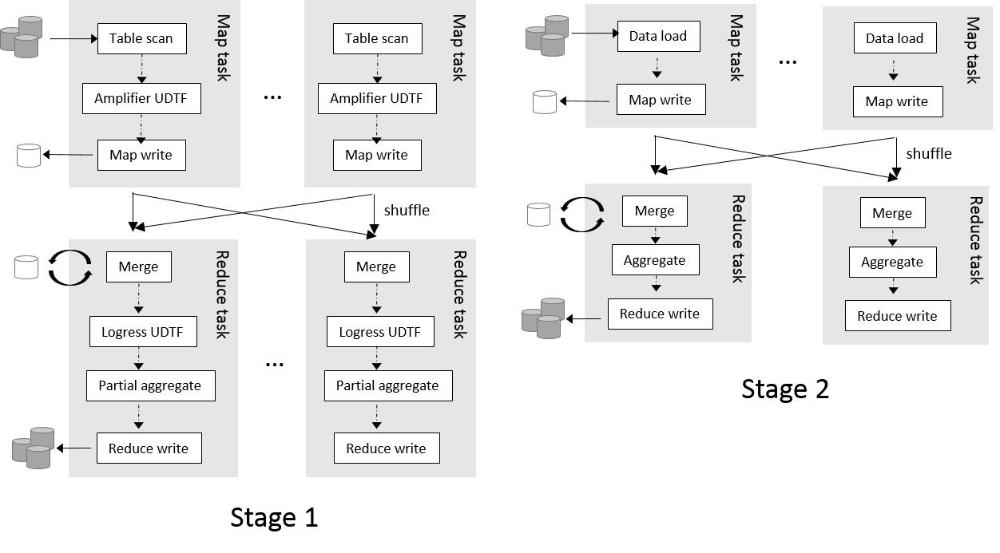
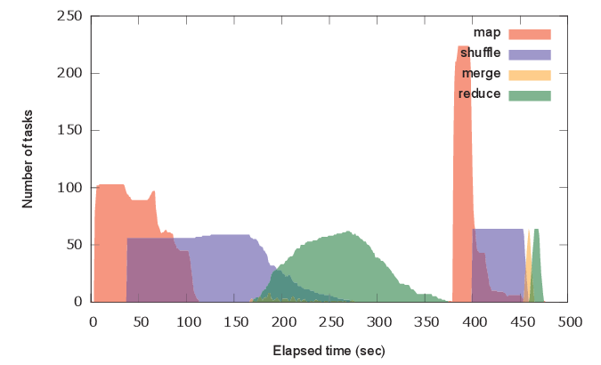
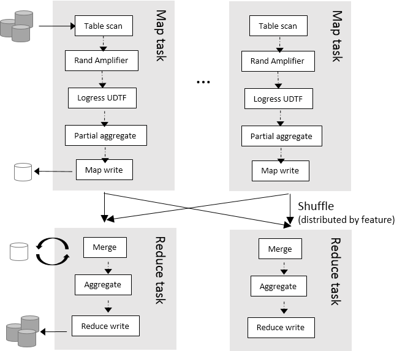
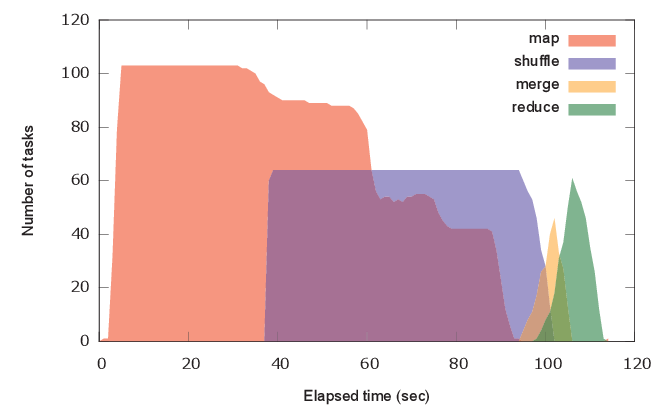

<!--
  Licensed to the Apache Software Foundation (ASF) under one
  or more contributor license agreements.  See the NOTICE file
  distributed with this work for additional information
  regarding copyright ownership.  The ASF licenses this file
  to you under the Apache License, Version 2.0 (the
  "License"); you may not use this file except in compliance
  with the License.  You may obtain a copy of the License at

    http://www.apache.org/licenses/LICENSE-2.0

  Unless required by applicable law or agreed to in writing,
  software distributed under the License is distributed on an
  "AS IS" BASIS, WITHOUT WARRANTIES OR CONDITIONS OF ANY
  KIND, either express or implied.  See the License for the
  specific language governing permissions and limitations
  under the License.
-->
        
This article explains *amplify* technique that is useful for improving prediction score.

Iterations are mandatory in machine learning (e.g., in [stochastic gradient descent](http://en.wikipedia.org/wiki/Stochastic_gradient_descent)) to get good prediction models. However, MapReduce is known to be not suited for iterative algorithms because IN/OUT of each MapReduce job is through HDFS.

In this example, we show how Hivemall deals with this problem. We use [KDD Cup 2012, Track 2 Task](../regression/kddcup12tr2_dataset.html) as an example.

<!-- toc -->

---
# Amplify training examples in Map phase and shuffle them in Reduce phase
Hivemall provides the **amplify** UDTF to enumerate iteration effects in machine learning without several MapReduce steps. 

The amplify function returns multiple rows for each row.
The first argument `${xtimes}` is the multiplication factor.  
In the following examples, the multiplication factor is set to 3.

```sql
set hivevar:xtimes=3;

create or replace view training_x3
as
select 
  * 
from (
select
   amplify(${xtimes}, *) as (rowid, label, features)
from  
   training_orcfile
) t
CLUSTER BY rand();
```

In the above example, the  [CLUSTER BY](https://cwiki.apache.org/confluence/display/Hive/LanguageManual+SortBy#LanguageManualSortBy-SyntaxofClusterByandDistributeBy) clause distributes Map outputs to reducers using a random key for the distribution key. And then, the input records of the reducer is randomly shuffled.

The multiplication of records and  the random shuffling has a similar effect to iterations.
So, we recommend users to use an amplified view for training as follows:

```sql
create table lr_model_x3 
as
select 
 feature,
 cast(avg(weight) as float) as weight
from 
 (select 
     logress(features,label) as (feature,weight)
  from 
     training_x3
 ) t 
group by feature;
```

The above query is executed by 2 MapReduce jobs as shown below:


Using *trainning_x3*  instead of the plain training table results in higher and better AUC (0.746214) in [this example](../regression/kddcup12tr2_lr_amplify.html#conclusion).

A problem in `amplify()` is that the shuffle (copy) and merge phase of the stage 1 could become a bottleneck.
When the training table is so large that involves 100 Map tasks, the merge operator needs to merge at least 100 files by (external) merge sort! 

Note that the actual bottleneck is not M/R iterations but shuffling training instance. Iteration without shuffling (as in [the Spark example](http://spark.incubator.apache.org/examples.html)) causes very slow convergence and results in requiring more iterations. Shuffling cannot be avoided even in iterative MapReduce variants.



---
# Amplify and shuffle training examples in each Map task

To deal with large training data, Hivemall provides **rand_amplify** UDTF that randomly shuffles input rows in a Map task.
The rand_amplify UDTF outputs rows in a random order when the local buffer specified by ${shufflebuffersize} is filled.

With rand_amplify(), the view definition of training_x3 becomes as follows:
```sql
set hivevar:shufflebuffersize=1000;

create or replace view training_x3
as
select
   rand_amplify(${xtimes}, ${shufflebuffersize}, *) as (rowid, label, features)
from  
   training_orcfile;
```

The training query is executed as follows:



The map-local multiplication and shuffling has no bottleneck in the merge phase and the query is efficiently executed within a single MapReduce job.



Using *rand_amplify* results in a better AUC (0.743392) in [this example](../regression/kddcup12tr2_lr_amplify.html#conclusion).

---
# Conclusion

We recommend users to use *amplify()* for small training inputs and to use *rand_amplify()* for large training inputs to get a better accuracy in a reasonable training time.

| Method     | ELAPSED TIME (sec) | AUC |
|:-----------|--------------------|----:|
| Plain | 89.718 | 0.734805 |
| amplifier+clustered by | 479.855  | 0.746214 |
| rand_amplifier | 116.424 | 0.743392 |